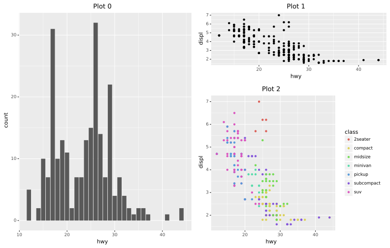

# cowpatch


[](https://github.com/benjaminleroy/cowpatch/actions/workflows/ci.yml)
[](https://codecov.io/gh/benjaminleroy/cowpatch)
[](https://www.codefactor.io/repository/github/benjaminleroy/cowpatch)

A package for combining/aranging multiple python ggplot visuals from [`plotnine`](https://plotnine.readthedocs.io/en/stable/)<!--, with allowances to also combined figures from [`matplotlib`](https://matplotlib.org/) and [`seaborn`](https://seaborn.pydata.org/)-->. Internally, we leverage SVG objects and descriptions to accomplish it's goals.

<!--
## Installation

Currently this project is under development and is not on
[pypi](https://pypi.org/). As such, to install this package please do the
following:

1. clone repository to your local computer (this assumes you have `git`
installed):
    ```bash
    $ git clone https://github.com/benjaminleroy/cowpatch.git
    ```
2. install `poetry` if you don't have it already
    ```bash
    $ pip install poetry
    ```
3. then install the package (you need to be in the `cowpatch` root folder)
    ```bash
    $ poetry install
    ```
-->

## Installation

To install the current version of this package, please run

```
pip install cowpatch
```

If you would like to experiment with the development version of this package
please following the guidelines in the contributing page.

## Usage

```python
import cowpatch as cow
import plotnine as p9
import plotnine.data as p9_data
import numpy as np
```

```python
# creation of some some ggplot objects
g0 = p9.ggplot(p9_data.mpg) +\
    p9.geom_bar(p9.aes(x="hwy")) +\
    p9.labs(title = 'Plot 0')

g1 = p9.ggplot(p9_data.mpg) +\
    p9.geom_point(p9.aes(x="hwy", y = "displ")) +\
    p9.labs(title = 'Plot 1')

g2 = p9.ggplot(p9_data.mpg) +\
    p9.geom_point(p9.aes(x="hwy", y = "displ", color="class")) +\
    p9.labs(title = 'Plot 2')
```

```python
vis_patch = cow.patch(g0,g1,g2)
vis_patch += cow.layout(design = np.array([[0,1],
                                           [0,2]]),
                        rel_heights = [1,2])
vis_patch.show(width = 11, height = 7)
```
<!--
```python
vis_patch.save(width=11, height=7, filename="images/readme.svg")
```
-->


Please see additional documentation pages like "Getting-Started" and the
individual pages on different plot arrangement strategies.

## Future Goals

This package is currently in development (please feel welcome to contribute, with code, examples, issues, publicity, etc.). We envision a sequence of versions coming out with different added features in each. The order of the features will look something like the following

- [x] MVP #1: base implimentation (reflecting `cowplot` and `gridExtra` functionality, minus labeling and titles)
- [ ] MVP #2: figure labeling and titles and `cow.text()` objects
- [ ] MVP #3: "Arithmetic of arrangement" (reflecting `patchwork`)

In addition, we envision the following features coming along in parallel:

- [ ] inseting plots (like seen in `cowplot`)
- [ ] wrapping of `matplotlib`, `plotnine` and `seaborn` plots to work within the `cowpatch` framework and within the `patchwork` framework
- [ ] more complex drawing tools like the `R` package `grid` to allow for easy creation of complex features

For the interested reader, a lot of these ideas have been sketched in our `notes/` folder as "proof of concepts".

## Package Logistics

### Background and history

This package's name is a merging of the names of `R` packages' `cowplot` and `patchwork`. It attempts to provide similar plot arrangement and combination tools as `gridExtra`, `cowplot` and `patchwork` for the `plotnine`'s `ggplot` objects.

This package is not directly related to any of aforementioned packages (including the [Wilke Lab](https://wilkelab.org/), lead by Claus O. Wilke) but naturally stands on the shoulders of the contributions each of the packages made.

This package leverages a SVG backend to create the arangements. This may make the actual package a bit more "hacky" then some may like, but we hope it can still be of use to the community.


### Contributing

Interested in contributing? Check out the contributing guidelines. Please note that this project is released with a Code of Conduct. By contributing to this project, you agree to abide by its terms.

### License

`cowpatch` was created by [Benjamin LeRoy](https://benjaminleroy.github.io/) ([benjaminleroy](https://github.com/benjaminleroy)) and Mallory Wang ([wangmallory](https://github.com/wangmallory)). It is licensed under the terms of the MIT license.

### Credits

This `python` package stands on the shoulders of many open-source tools, `cowpatch` structure was created with [`cookiecutter`](https://cookiecutter.readthedocs.io/en/latest/) and the `py-pkgs-cookiecutter` [template](https://github.com/py-pkgs/py-pkgs-cookiecutter), the documentation leverages [`sphinx`](https://www.sphinx-doc.org/en/master/), and underlying testing leverages [`pytest`](https://docs.pytest.org/en/7.0.x/), [`hypothesis`](https://hypothesis.readthedocs.io/en/latest/) and [`pytest-regression`](https://pytest-regressions.readthedocs.io/en/latest/overview.html). See the full list of package dependencies on [Github](https://github.com/benjaminleroy/cowpatch/blob/main/pyproject.toml).

