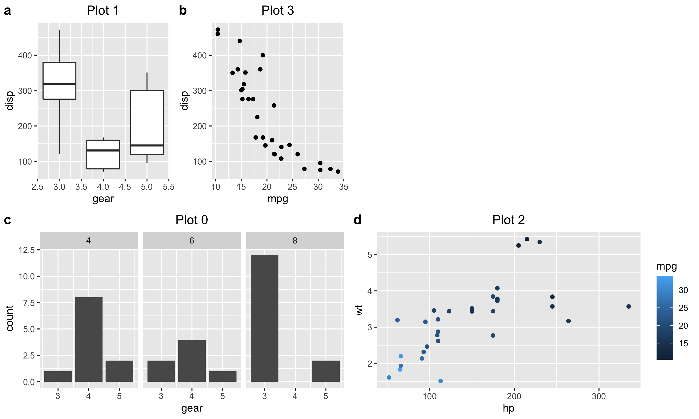
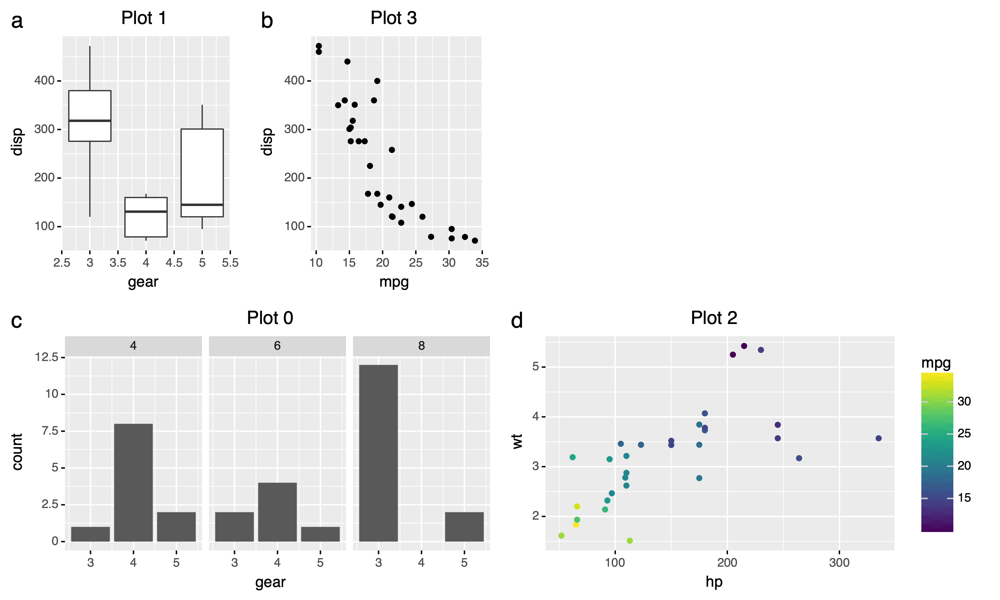

# `notes` folder

In this folder, I've basically just demonstrated the underlying potential to
a create a combination of plots that minic that done in `R` packages like
`cowplot`, `gridExtra` and `patchwork`.

The demonstration in the `proof_of_concept_*.py` files aims to create objects
similar to that see in the above `R` packages but with `python` and `python`'s
`plotnine` package. Specifically, we take one specific example and attempt to
create a similar image in `python` that is expected in `R`. This visual example
is demonstrated in `R` inside the `Rimages/cowplot_experiment.R` file, which
creates a set of `.png` objects, including:

  

which presents an arangement of plots with labels added.

The most extensive replication of this plot can be found in the
`proof_of_concept_combined_svg.py` file which creates many different file
extensions of the following image (with a focus on creating such things in
`.svg` extensions first).

  

